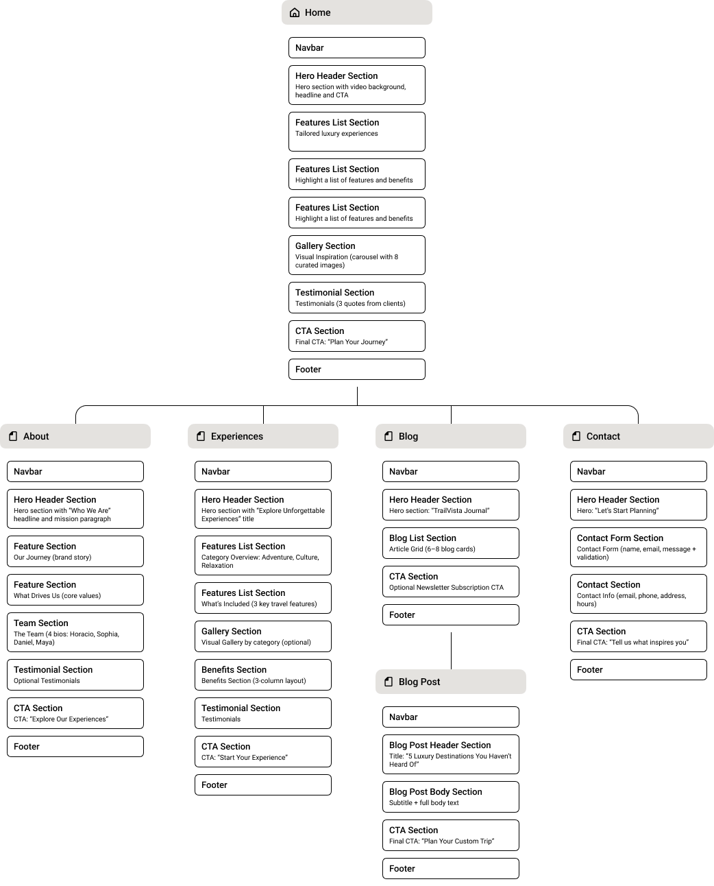
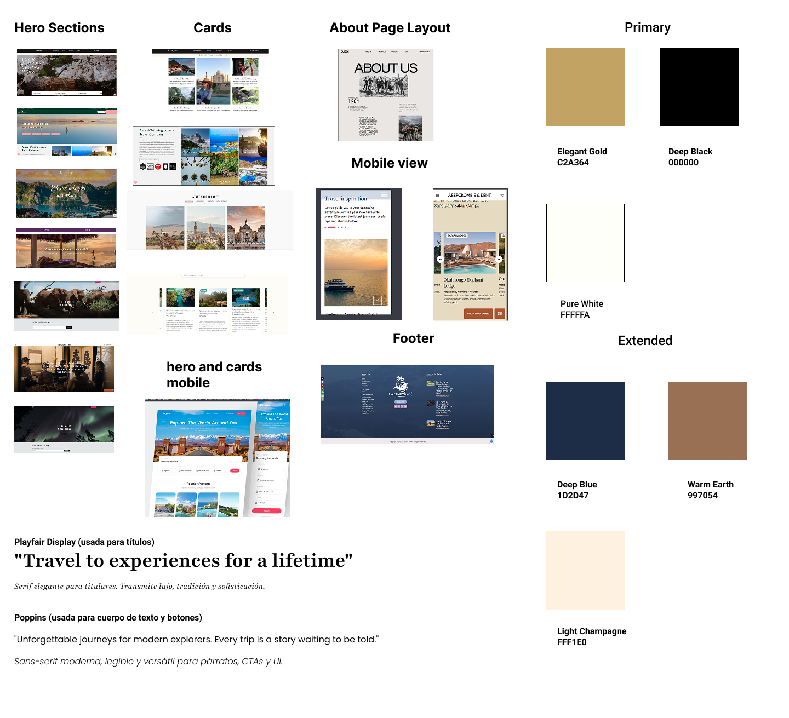
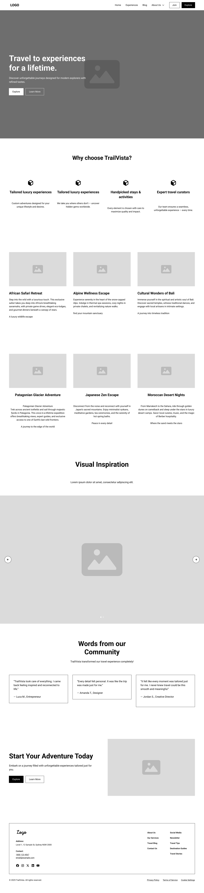

# TrailVista – Viaja hacia experiencias para toda la vida

TrailVista es una agencia de viajes de lujo dedicada a diseñar recorridos inolvidables y personalizados para exploradores modernos. Nuestra misión es ofrecer experiencias de viaje exclusivas para personas exigentes que buscan más que simples vacaciones: anhelan significado, belleza, cultura e inspiración.

Desde safaris privados y retiros en la montaña hasta recorridos culturales inmersivos y escapadas de bienestar, TrailVista conecta a los viajeros con destinos seleccionados y aventuras auténticas en todo el mundo.

## Proceso de Diseño Visual

Para guiar la estructura y estética de TrailVista, se desarrollaron y documentaron los siguientes recursos de diseño utilizando Figma:

---

### Mapa del Sitio – Page Architecture

<p align="center">
  
</p>

El mapa del sitio describe la estructura completa del sitio web de TrailVista, incluyendo seis páginas principales: Inicio, Acerca de, Experiencias, Blog, Entrada del Blog y Contacto. Esta jerarquía garantiza claridad en la navegación y distribución del contenido.

---


###  Moodboard

<p align="center">
  
</p>

El moodboard representa la identidad visual de TrailVista: una marca de viajes lujosa y aventurera. Combina tonos neutros cálidos, matices dorados, tipografía elegante e imágenes seleccionadas que evocan experiencias premium y exploración global.

---

##  Wireframe de Baja Fidelidad

<p align="center">
  
</p>

Este wireframe de baja fidelidad define la estructura de la página de inicio: video principal (hero), sección de beneficios, experiencias destacadas, carrusel de galería, testimonios y un llamado final a la acción — todo organizado utilizando los principios de la cuadrícula de Bootstrap.


##  Características

- Diseño responsivo con Bootstrap 5.3.2  
- Sección principal (hero) con video de fondo a pantalla completa  
- Sección curada de "Experiencias Destacadas" con imágenes optimizadas  
- Carrusel de Inspiración Visual (8 momentos de viaje premium)  
- Testimonios de clientes  
- Llamado final a la acción con navegación directa  
- CSS completamente modular para facilitar el mantenimiento  
- Integración de favicon en múltiples formatos

##  Paginas


- `index.html` – Página de inicio  
- `about.html` – Historia de la empresa, misión, equipo  
- `experiences.html` – Categorías de viaje (aventura, relax, cultura)  
- `blog.html` – Vista general de artículos del blog de viajes  
- `blog-post.html` – Artículo destacado individual  
- `contact.html` – Formulario de contacto con validación en JavaScript


##  Herramientas Utilizadas

- **Visual Studio Code** – Editor principal de código  
- **Git + GitHub** – Control de versiones y despliegue  
- **Figma** – Moodboard, wireframes y planificación visual  
- **Coolors** – Generación de paletas de colores  
- **Google Fonts** – Combinación tipográfica (serif + sans serif)  
- **Bootstrap 5.3.2** – Diseño responsivo y componentes  
- **JavaScript (modo estricto)** – Validación de formularios en el cliente  
- **Squoosh.app** – Optimización de imágenes: https://squoosh.app/  
- **favicon.io** – Generación de favicons en múltiples formatos: https://favicon.io/  
- **Movavi Video Suite** – Edición y combinación del video de fondo principal  
- **Bancos de medios gratuitos** – Videos e imágenes de plataformas como Freepik, Pixabay y Unsplash

##  estructura del proyecto

```
/assets/
├── home/
│   ├── experiences/
│   └── inspiration/
├── logo/
├── favicon/
css/
  └── style.css
js/
  └── script.js
index.html
about.html
experiences.html
blog.html
blog-post.html
contact.html
README.md
```


##  Autor

**Fabian Beltran**  
Frontend Developer | UX/UI Designer

[](https://github.com/fabian1031)


---

[Bitácora de desarrollo – Ver avances y decisiones día a día](./bitacora.md)
